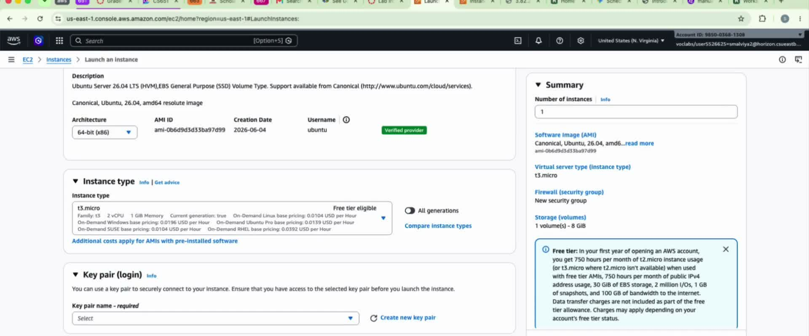
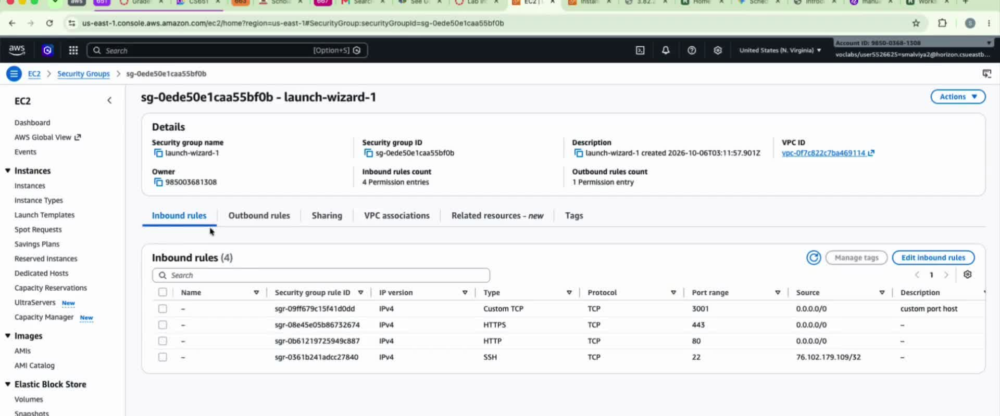
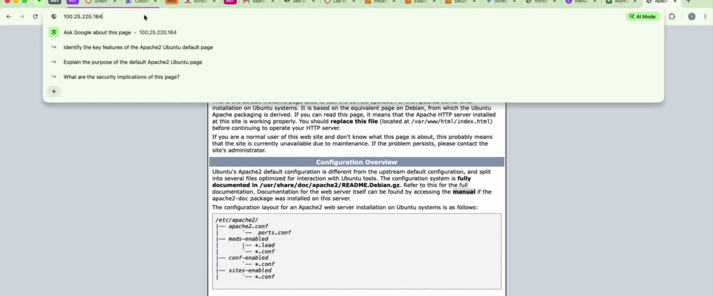
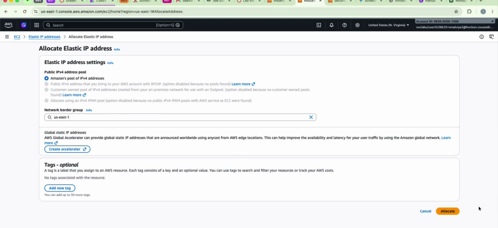
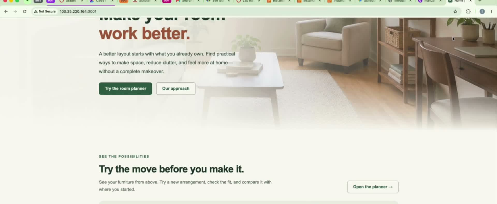
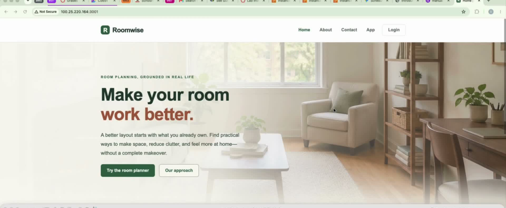
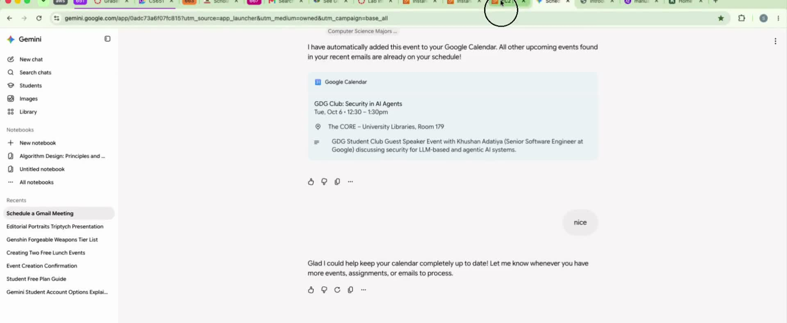

# CS651 Project 1 — Part 2: Roomwise on AWS EC2 (Docker + Apache)

**Deployed site:** http://100.25.220.164:3001 *(as shown in the demo video; the
EC2 instance is currently stopped, so the URL is offline — see Issues)*
**Demo video:** https://www.youtube.com/watch?v=5XGYLz5UdvA
**Team:** Roomwise group (based on `sean10203040/CS651-Website-Project`)

Part 2 deploys the Roomwise site on an **Amazon EC2** Ubuntu instance. The site
is packaged in a **Docker** container (Apache + the compiled `dist/` files);
the container's port 80 is published on the instance's port 3001.

Part 3 (separate repo) re-deploys the same site on S3 static hosting — no
server, no container.

## Deployment steps

### 1. Launch the EC2 instance

EC2 console → Launch instance. Ubuntu Server 26.04 LTS, **t3.micro** (free tier
eligible), 8 GB storage, region `us-east-1`.



### 2. Create and secure the SSH key

Create a key pair (`key_projlec2.pem`), download it, then lock it down:

```bash
cd ~/Downloads
chmod 400 key_projlec2.pem
ssh -i key_projlec2.pem ubuntu@<ec2-public-ip>
```

### 3. Install Docker on EC2

```bash
sudo apt install docker.io -y
docker --version
sudo systemctl status docker
```

### 4. Transfer Roomwise to EC2

```bash
scp -i ~/Downloads/key_projlec2.pem -r . ubuntu@<ec2-public-ip>:~/CS651_Part1_Launchpad
```

### 5. Build the RoomWise Docker image

On the instance, from `~/CS651_Part1_Launchpad/`:

```bash
sudo docker build -f DockerContainer/Dockerfile -t roomwise .
```

The image is Apache (`httpd:2.4`) plus our compiled `dist/` website files —
see `CS651_Part1_Launchpad/DockerContainer/Dockerfile`.

### 6. Open port 3001 in the security group

EC2 port 80 was already occupied by an Apache installed directly on the
Ubuntu host, so the container is published on **port 3001** instead.
Security group inbound rules: Custom TCP **3001** from `0.0.0.0/0`,
plus HTTPS 443, HTTP 80, and SSH 22 (restricted to our IP).



Port flow: browser → EC2 public port **3001** → Docker forwards to container
port **80** → Apache inside the container serves the site.

### 7. Run the container

```bash
sudo docker run -d -p 3001:80 --name roomwise roomwise
```



### 8. Allocate an Elastic IP (Special Issue 2)

Every stop/start gives the instance a **new public IP**, breaking the URL.
We allocated an Elastic IP so the address survives reboots —
see the Special Issues wiki page.



### 9. Open the site and verify

Roomwise loads with the EC2 URL visible in the address bar:





The walkthrough covers all five pages (Home, About, Contact, App, Login),
the React room planner, sign-in state transfer, CSS styling, and the
Bootstrap/JavaScript interactions.



## Issues encountered

- **Port 80 was already taken.** An Apache installed directly on the Ubuntu
  host occupied port 80, so the container is published on port **3001**
  (`-p 3001:80`) with a matching security-group rule.
- **Public IP changes on every stop/start.** The demo video shows three
  different IPs across takes. Fixed with an Elastic IP (Special Issue 2).
- **Instance is currently stopped**, so the deployed URL is offline. The video
  documents the working deployment.

## Cost

Approximate public EC2 pricing (us-east-1); our actual spend was $0 inside the
course Learner Lab:

| Item | Approx. price | This project |
| --- | --- | --- |
| t3.micro instance | ~$0.0104 / hour | a few hours → ~$0.05 |
| EBS storage (8 GB) | ~$0.08 / GB / month | ~$0.64 / month if kept |
| Elastic IP (attached) | $0 while attached to a running instance | $0 |
| Data transfer out | first 100 GB / month free | $0 |

**Bottom line:** an always-on t3.micro costs roughly $7–8/month on demand —
orders of magnitude more than the fractions of a cent S3 hosting costs in
Part 3. Inside the Learner Lab it was $0.

## Repository contents

Full site source (based on the group repo): static HTML pages, `styles.css`
(Roomwise design system), Bootstrap 5.3.3, React 18 SPA source, images and
supporting files, plus `CS651_Part1_Launchpad/DockerContainer/Dockerfile`
(the required Docker container). Build with `node build.mjs` (esbuild) to
regenerate `dist/`.

## Wiki

- **YouTube Link** — demo video (Docker creation, deployment, running site + URL)
- **Docker Creation** — screenshots of the Docker image build and deployment
- **Special Issues** — PDF answering Special Issue 1 (stopped instance → AMI)
  and Special Issue 2 (reboot → IP change → Elastic IP)
